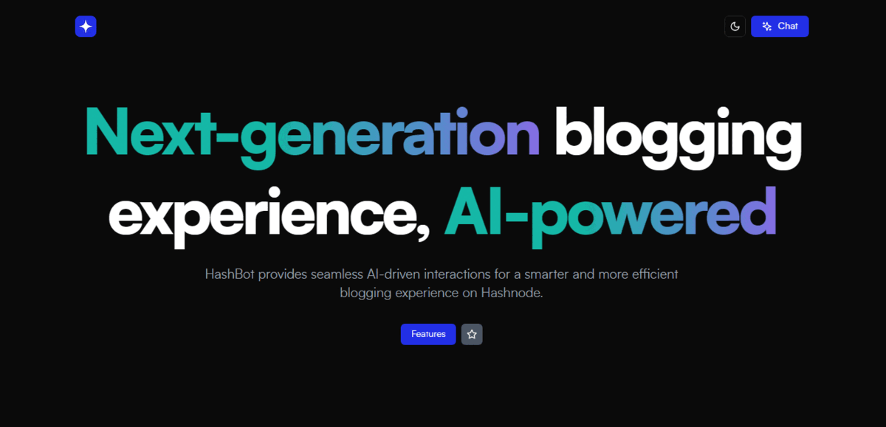

<p align="center" id="top">
	
	<p align="center">✨ Redefining your Hashnode experience with AI.</p>
</p>

<div align="center">


[](https://github.com/omzi/hashbot/issues)
[](https://opensource.org/licenses/MIT)


</div>

<h4 align="center"><a href="https://hashbot-v0.vercel.app"><i>Live Demo</i> 🚀</a></h4>



---

## 📜 **About**

HashBot is your go-to application, designed to allow you perform action on your Hashnode account away from the "noise." Read up the article to know more about HashBot:


> **Link**: *https://omzi.hashnode.dev/redefining-your-hashnode-experience-with-hashbot*

## ⚙️ **Features**

- [ ] AI Chat (on temporary hiatus)
- [x] Seamless Post Import (DEV.to & Medium)
- [x] Infinite Posts & Drafts Viewing
- [x] Hashnode Token Sign-In
- [x] Sidebar with Post & Draft Count
- [x] Light/Dark Mode Switcher
- [x] Globally Accessible Command Modal (⌘ + K)

## 🛠 **Tech Stack**

- **_FrontEnd:_** [Next.js](https://nextjs.org/) & [TypeScript](https://www.typescriptlang.org/)
- **BackEnd:_** [Next.js API Routes](https://nextjs.org/docs/pages/building-your-application/routing/api-routes) & [Hashnode GraphQL API](https://apidocs.hashnode.com/)
- **_Authentication:_** [Hashnode Personal Access Token (PAT)](https://support.hashnode.com/en/articles/6423579-developer-access-token), [Next.js Middleware](https://nextjs.org/docs/pages/building-your-application/routing/middleware)
- **_Styling:_** [Tailwind CSS](https://tailwindcss.com/) & [shadcn/ui](https://ui.shadcn.com/) components

## 🚩 **Prerequisites**

Ensure that your system meets the following requirements:

- [Node.js](https://nodejs.org/) version >= 18.18.0
- [npm](https://www.npmjs.com/) version >= 9.8.1

## ⚡ **Installation**

Before proceeding, make sure your system satisfies the prerequisites mentioned above. <br><br>
Firstly, clone the HashBot repository into your desired folder and navigate into it:

```shell
$ git clone https://github.com/omzi/hashbot && cd hashbot
```

Install the project dependencies using npm (or yarn if you prefer):

```shell
npm i
```

## ⚙ **Environment Variables**

HashBot requires certain environment variables to be set to function properly. Create a `.env` file in the root of your project and add the following variables:

```shell
NODE_ENV = # Your current environment
NEXT_PUBLIC_HASHNODE_GQL_ENDPOINT = # Hashnode's GraphQL API endpoint
OPENAI_API_KEY = # Your OpenAI API key
```

Explanation of the environment variables:

- **`NODE_ENV`**: Set it to `development` for local development.
- **`NEXT_PUBLIC_HASHNODE_GQL_ENDPOINT`**: Hashnode's GraphQL API endpoint. Set the value to `https://gql.hashnode.com`.
  For external services:
- **`OPENAI_API_KEY`**: Your [OpenAI](https://openai.com) API key. If you don't have an API key, you'll have to [create one](https://platform.openai.com/api-keys).

Once the environment variables are set, you can run HashBot locally with:

```shell
npm run dev
```

Visit the URL `http://localhost:3000/` in your browser to access the HashBot application.

## 👥 **Contributors**

- [Omezibe Obioha](https://github.com/omzi/) (@0xOmzi)

## 📄 **License**

This project is licensed under the MIT License. See the [`LICENSE`](./LICENSE) file for more details.

## ❌ **Disclaimer**

HashBot is a work-in-progress. You may experience errors or bugs while testing out the application. Feel free to reach to me on Twitter ([@0xOmzi](https://twitter.com/0xOmzi)) regarding any issue you might be facing.

---

[Back To Top ↺](#top)

> Made with &#9829;